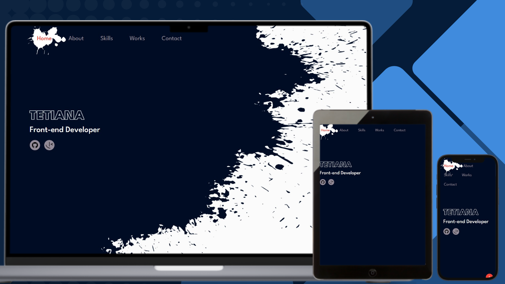

# Personal Portfolio Webpage

# Description

This project is a solution for the "Build a Personal Portfolio Webpage" challenge from [freeCodeCamp](https://www.freecodecamp.org/). It includes a responsive portfolio page with smooth scrolling, project showcase, and contact form functionality.

## Links

- [Solution URL on GitHub]()
- [Live Site on GitHub Pages]()

## Built with

### Frontend

- HTML
- CSS
- JS