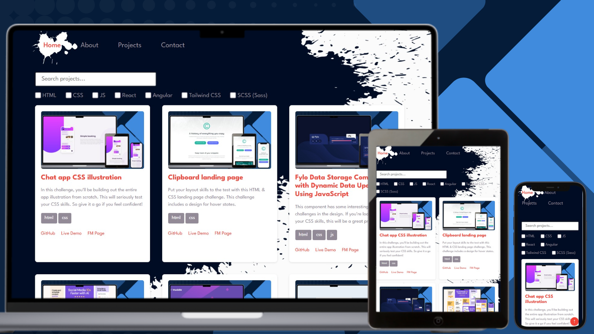

# All Projects Page — Portfolio Extension 

# Description

This page is an extension of the main portfolio.
It displays all completed projects with a convenient filter system and search functionality for easier browsing.

## ✨ Features
- Display of all portfolio projects from a JSON file
- Real-time search by project name
- Filter by categories using checkboxes

## Links

- [Solution URL on GitHub]()
- [Live Site on GitHub Pages]()

## Built with

### Frontend

- HTML
- CSS
- JS